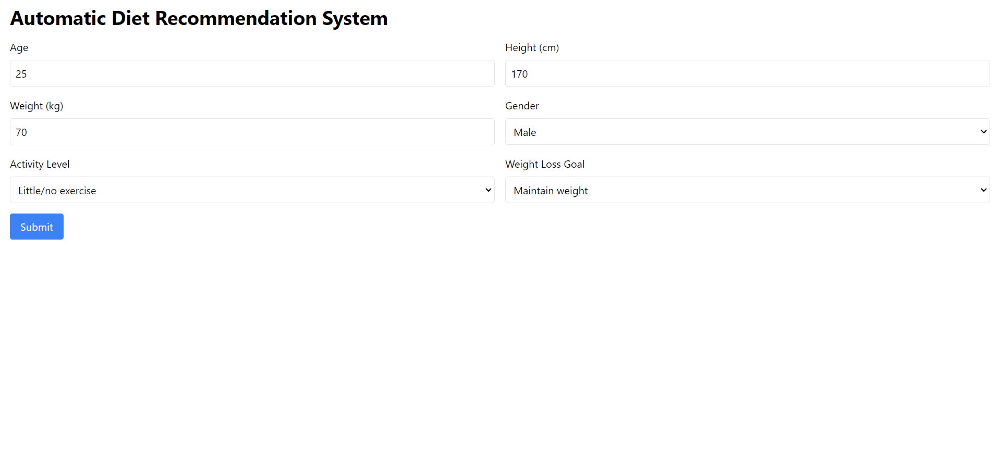
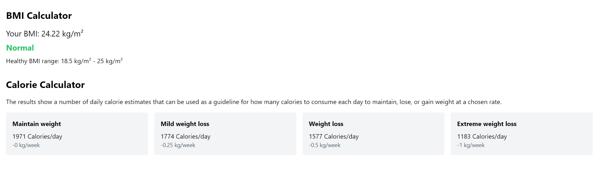

<h1>Diet Recommendation System</h1>

Welcome to the <strong>Diet Recommendation System</strong>! This project provides personalized diet recommendations based on user inputs and preferences. The application leverages machine learning models to generate diet suggestions, utilizing data and algorithms to create tailored meal plans.

  <h2>Technologies Used</h2>
    <ul>
        <li><strong>Frontend:</strong>
            <ul>
                <li>React</li>
                <li>Vite</li>
                <li>TypeScript (TSX)</li>
            </ul>
        </li>
        <li><strong>Backend:</strong>
            <ul>
                <li>FastAPI</li>
                <li>Python</li>
            </ul>
        </li>
        <li><strong>Machine Learning Model:</strong>
            <ul>
                <li>Trained using a dataset from Kaggle</li>
                <li>Scikit-learn / TensorFlow (depending on the implementation)</li>
            </ul>
        </li>
    </ul>

  <h2>Features</h2>
    <ul>
        <li>User-friendly interface built with React and TypeScript for smooth interaction.</li>
        <li>FastAPI backend to handle API calls and data processing.</li>
        <li>Personalized diet recommendations powered by a machine learning model.</li>
        <li>Input options for various user preferences, such as health goals, food allergies, and dietary restrictions.</li>
        <li>Simple and intuitive design, ensuring a great user experience.</li>
    </ul>

  <h2>Getting Started</h2>
    
To get started with this project, follow these steps:

  <h3>1. Clone the repository</h3>
    <pre><code>git clone https://github.com/yourusername/diet-recommendation-system.git
cd diet-recommendation-system</code></pre>

  <h3>2. Set up the Frontend</h3>
    <ol>
        <li>Install the required dependencies for the frontend:
            <pre><code>cd frontend
npm install</code></pre>
        </li>
        <li>Run the frontend locally:
            <pre><code>npm run dev</code></pre>
        </li>
    </ol>

  <h3>3. Set up the Backend</h3>
    <ol>
        <li>Navigate to the backend folder:
            <pre><code>cd backend</code></pre>
        </li>
        <li>Create and activate a virtual environment (optional but recommended):
            <pre><code>python -m venv venv
source venv/bin/activate  # On Windows: venv\Scripts\activate</code></pre>
        </li>
        <li>Install the backend dependencies:
            <pre><code>pip install -r requirements.txt</code></pre>
        </li>
        <li>Run the FastAPI server:
            <pre><code>uvicorn main:app --reload</code></pre>
        </li>
    </ol>

  
Now, both the frontend and backend should be running, and the application will be accessible in your browser.

   <h2>Model Explanation</h2>
    
The machine learning model used in this project was trained on a Kaggle dataset to predict and recommend diets based on input features such as:

    <ul>
        <li>Age</li>
        <li>Gender</li>
        <li>Health conditions</li>
        <li>Food preferences</li>
        <li>Caloric intake requirements</li>
    </ul>
    
The backend API serves as a bridge between the frontend and the trained model, handling data processing and response delivery.

   <h2>Output Example</h2>
    
Once the user inputs their preferences, they will receive personalized diet recommendations. Here is a sample of what the output might look like:

    
    

   <h2>Contributing</h2>
    
We welcome contributions! If you'd like to contribute to this project, please follow these steps:

    <ol>
        <li>Fork the repository</li>
        <li>Create your feature branch (<code>git checkout -b feature-name</code>)</li>
        <li>Commit your changes (<code>git commit -m 'Add new feature'</code>)</li>
        <li>Push to the branch (<code>git push origin feature-name</code>)</li>
        <li>Open a Pull Request</li>
    </ol>
    
Please make sure to write tests and ensure that the application runs smoothly after changes.

  <h2>License</h2>
    
This project is licensed under the MIT License - see the <a href="LICENSE">LICENSE</a> file for details.

   <h2>Thank you for checking out the Diet Recommendation System!</h2>
